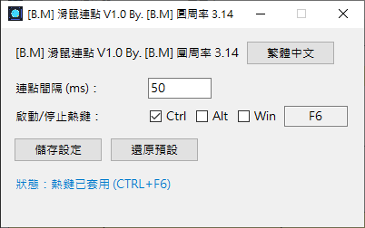

# [B.M] 滑鼠連點

[](#系統需求)
[](https://www.python.org/)
[](https://pyinstaller.org/)
[](https://github.com/BoringMan314/bm-mouse-click)
[](LICENSE)

Windows / macOS 滑鼠左鍵連點工具，支援全域熱鍵切換、系統匣操作、多語系介面與設定檔保存。

*Windows / macOS 鼠标左键连点工具，支持全局热键切换、系统托盘操作、多语言界面与本地设置保存。*  

*Windows / macOS の左クリック連打ツール。グローバルホットキー切替、システムトレイ操作、多言語 UI、設定保存に対応。*  

*A mouse auto clicker for Windows/macOS with global hotkey toggle, tray controls, multilingual UI, and local settings persistence.*

> **聲明**：本專案為第三方輔助工具，請遵守各平台與軟體使用規範。

---



---

## 目錄

- [功能](#功能)
- [系統需求](#系統需求)
- [安裝與打包](#安裝與打包)
- [檢查流程（建議）](#檢查流程建議)
- [本機開發與測試](#本機開發與測試)
- [技術概要](#技術概要)
- [專案結構](#專案結構)
- [設定檔與多語系](#設定檔與多語系)
- [隱私說明](#隱私說明)
- [授權](#授權)
- [問題與建議](#問題與建議)

---

## 功能

- 滑鼠左鍵連點（可自訂間隔毫秒）。
- 熱鍵切換連點（`Ctrl`、`Alt`、`Win` 任選，至少 2 個 + 一個按鍵）。
- 內建語言：繁體中文、簡體中文、日本語、English；**可**在設定檔根層 `languages` **新增**其他語系代碼。**每一**語系物件的**鍵集合**須與程式內建 `BUILTIN_I18N["zh_TW"]`（`main.py`）**完全一致**，缺一即驗證失敗，程式會刪除壞檔並寫入內建預設。
- 系統匣功能：
  - 左鍵預設動作還原視窗到 `100,100`
  - 右鍵選單：關於我、離開（鍵名 `about`、`exit`）
- 防多開：後開會結束前開實例（含 EXE 改名／複製情境）。
- 開關連點時播放 `wav/switch.wav` 音效（Windows 用 `winsound`，macOS 用 `afplay`）。

---

## 系統需求

- **Windows 10+**（一般使用專案根目錄的 `bm-mouse-click.exe`）。
- **Windows 7** 請使用專案根目錄的 **`bm-mouse-click_win7.exe`**；執行前請完成下方〈Win7 執行前必要環境〉（細節與疑難排解見 `README-WIN7.txt`）。
- **macOS**：於 macOS 本機執行 `build_mac.sh` 產出 `.app`（預設於 `dist/`）。
- Python 3.10+（開發／Win10 鏈打包時需要）；Win7 鏈打包需 Python **3.8.x**。

### Win7 執行前必要環境

- Windows 7 SP1。
- 安裝系統更新：`KB2533623`、`KB2999226`（Universal CRT）。
- 安裝 **Microsoft Visual C++ Redistributable 2015–2022**（x86／x64 依系統選擇）。
- 若啟動仍出現缺少 `api-ms-win-core-*.dll`，請依 `README-WIN7.txt` 核對更新與執行檔版本後再試。

---

## 安裝與打包

### 安裝（使用 Releases）

1. 下載 [Releases](https://github.com/BoringMan314/bm-mouse-click/releases) 的 `bm-mouse-click.exe`（Win7 請用 `bm-mouse-click_win7.exe`）。
2. 放到任意資料夾後直接執行。
3. 首次執行會在同目錄建立 `bm-mouse-click.json`。

### Windows 7

```bat
build_win7.bat
```

輸出（專案**根目錄**）：

- `bm-mouse-click_win7.exe`

### Windows 10/11

```bat
build_win10.bat
```

輸出（專案**根目錄**）：

- `bm-mouse-click.exe`

### Windows（雙工具鏈：Win10/11 + Win7）

```bat
build_win10+win7.bat
```

或（等同上者）：

```powershell
powershell -ExecutionPolicy Bypass -File .\build.ps1
```

可指定不同 Python 版本（建議）：

```powershell
powershell -ExecutionPolicy Bypass -File .\build.ps1 -PyWin10 "py -3.13" -PyWin7 "py -3.8"
```

輸出（專案**根目錄**）：

- `bm-mouse-click.exe`
- `bm-mouse-click_win7.exe`

說明：

- PyInstaller 先輸出至暫存目錄 `dist`，`build_win10.bat`／`build_win7.bat` 會將 exe **搬移到專案根目錄**，再清空 `build`／`dist` 內容。
- `bm-mouse-click.exe`：使用 `requirements-win10.txt`（Win10/11 工具鏈）。
- `bm-mouse-click_win7.exe`：使用 `requirements-win7.txt`（Win7 相容工具鏈）。
- 在 Win7 上請執行 `bm-mouse-click_win7.exe`，不要執行 `bm-mouse-click.exe`。
- 兩份 `.bat` 直接使用 PATH 上的 Python；若改跑 `build.ps1`，仍會建立 `.venv-build-win10`、`.venv-build-win7` 以隔離兩套依賴。

### macOS（Terminal）

```bash
chmod +x build_mac.sh
./build_mac.sh
```

輸出（預設於 `dist/`）：

- `dist/bm-mouse-click_mac_arm64.app`
- `dist/bm-mouse-click_mac_x86_64.app`
- `dist/bm-mouse-click_mac_universal2.app`

---

## 檢查流程（建議）

1. 啟動後主視窗是否出現於第一螢幕約 `100,100`（Windows 參考行為）。
2. 熱鍵能否正常啟停連點；間隔毫秒修改後是否生效。
3. 熱鍵在視窗縮到系統匣後是否仍可用（Windows）。
4. 語言按鈕循環、`bm-mouse-click.json` 讀寫是否正常（**每個**語系區塊鍵集須與內建 `zh_TW` 一致，否則會覆寫為預設）。
5. 系統匣左鍵預設動作能否還原視窗；右鍵「關於我」「離開」是否正常。
6. 連續啟動兩次是否僅保留最後一個實例。
7. （選用）開發者可用 `check.ps1` 做快速檢查或 `-WithBuild` 驗證打包；詳見腳本說明。

---

## 本機開發與測試

```bash
python -m pip install -r requirements-win10.txt
python main.py
```

---

## 技術概要

- GUI：`tkinter`
- 系統匣：`pystray`
- 滑鼠點擊：`pynput`
- 熱鍵：`keyboard`
- 打包：`pyinstaller`
- 設定檔：EXE 同層 `bm-mouse-click.json`（Win10／Win7 exe 共用）

---

## 專案結構


| 路徑                            | 說明                              |
| ----------------------------- | ------------------------------- |
| `main.py`                      | 主程式（UI、熱鍵、連點、系統匣、防多開）           |
| `build_win7.bat`               | Win7 單檔打包（最終 exe 於專案根目錄）          |
| `build_win10.bat`              | Win10 單檔打包（最終 exe 於專案根目錄）         |
| `build_win10+win7.bat`         | Win10 + Win7 雙版（呼叫 `build.ps1`） |
| `build.ps1`                    | Windows 雙版打包腳本（PowerShell）      |
| `check.ps1`                    | 檢查腳本（可選 `-WithBuild` 驗證打包）      |
| `build_mac.sh`                 | macOS 打包腳本                      |
| `version_info.txt`             | Windows exe 檔案版本資源               |
| `requirements-win10.txt`       | Win10/11 打包用 Python 相依套件       |
| `requirements-win7.txt`        | Win7 打包用 Python 相依套件         |
| `README-WIN7.txt`              | Win7 執行環境（KB／VC++）說明          |
| `build_icon.py`                | 圖示相關輔助腳本                        |
| `generate_switch_wav.py`       | 產生 `wav/switch.wav`             |
| `icons/`                       | 圖示資源（`icon.ico`、`icon.png`）       |
| `wav/`                         | 音效資源（`switch.wav`）              |
| `screenshot/`                  | README 展示截圖（選用）                 |


---

## 設定檔與多語系

- 設定檔：`bm-mouse-click.json`（與 exe 同層）。
- `settings` 另含：`interval_ms`、`hotkey`（`ctrl`／`alt`／`win`／`key`）等，見 `main.py` 與既有預設檔。
- **內層嚴格**：根層 `languages` 底下**每一個**語系物件的**鍵集合**須與 `main.py` 內建 **`BUILTIN_I18N["zh_TW"]`** **完全相同**。**不可**只填部分鍵指望程式補齊；驗證失敗時會刪除壞檔並寫入內建預設。
- **外層可擴**：語系代碼數量**不**限於四個；循環順序為內建四語（實際存在之鍵）後接自訂代碼，依 JSON 出現序。
- 視窗標題產品名僅使用 **`project_name`**（與全系規格一致）。

在既有設定檔的 `languages` 中**新增**一個語系時，請貼上**完整**區塊。以下為**可直接使用**的韓文範例（鍵與 `BUILTIN_I18N["zh_TW"]` 對齊；`hint` 可為空字串）：

```json
"ko_KR": {
  "language_name": "한국어",
  "settings": "설정",
  "project_name": "마우스 연속 클릭",
  "interval": "클릭 간격 (ms):",
  "hotkey": "시작/중지 단축키:",
  "save_settings": "설정 저장",
  "restore_default": "기본값으로 복원",
  "status_stop": "상태: 중지됨",
  "status_run": "상태: 연속 클릭 중",
  "status_hotkey": "상태: 단축키 적용됨 ({hotkey})",
  "hint": "",
  "error_interval": "간격은 0보다 큰 정수(ms)여야 합니다.",
  "error_hotkey": "유효한 키를 입력하세요. 예: F6, Q",
  "about": "정보",
  "exit": "종료",
  "input_error_title": "입력 오류",
  "hotkey_error_title": "단축키 오류"
}
```

並將 `settings.languages` 設為 `ko_KR`（若要以韓文啟動）。併入後請確認 JSON 仍符合上述**鍵集全等**規則。

---

## 隱私說明

本工具為本機端執行程式，預設僅在本機讀寫同目錄設定檔（`*.json`），**不蒐集、不上傳**個人資料或使用行為資料。

目前程式僅有以下外部互動：

- 使用者在系統匣選單點擊「關於我」時，會開啟 `http://exnormal.com:81/`。
- 使用者自行透過 GitHub 下載、更新或回報 Issue 時，會依 GitHub 平台規則產生對應網路請求。

---

## 授權

本專案以 [MIT License](LICENSE) 授權。

---

## 問題與建議

歡迎使用 [GitHub Issues](https://github.com/BoringMan314/bm-mouse-click/issues) 回報錯誤或提出建議（請附上系統版本、重現步驟、錯誤訊息）。
